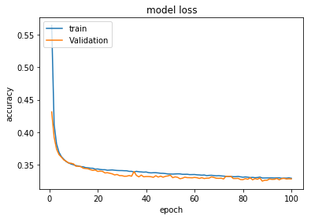
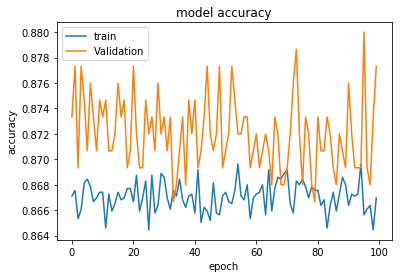

```python
import tensorflow
import keras
import warnings
warnings.filterwarnings('ignore')
```

    C:\Users\R.Hayeri\AppData\Local\Continuum\anaconda3\lib\site-packages\h5py\__init__.py:36: FutureWarning: Conversion of the second argument of issubdtype from `float` to `np.floating` is deprecated. In future, it will be treated as `np.float64 == np.dtype(float).type`.
      from ._conv import register_converters as _register_converters
    Using TensorFlow backend.
    

# 1- Data Preprocessing


```python
import numpy as np
import matplotlib.pyplot as plt
%matplotlib inline  
import pandas as pd
```


```python
## Importing the data set
dataset=pd.read_csv('Churn_Modelling.csv')
x = dataset.iloc[:,3:13].values   # The index 13th is not included.
y = dataset.iloc[:,13].values
```


```python
## Encoding categorical data
from sklearn.preprocessing import LabelEncoder, OneHotEncoder
labelencoder_x_1=LabelEncoder()
x[:,1] = labelencoder_x_1.fit_transform(x[:,1])
labelencoder_x_2=LabelEncoder()
x[:,2] = labelencoder_x_2.fit_transform(x[:,2])
onehotencoder = OneHotEncoder(categorical_features = [1])
x = onehotencoder.fit_transform(x).toarray()
X = x[:,1:]
```


```python
## Splitting the data set into Training set and Test sets
from sklearn.model_selection import train_test_split
X_train,X_test,y_train,y_test = train_test_split(X,y,test_size=0.25,random_state=0)

```


```python
## Features Scaling
from sklearn.preprocessing import StandardScaler
sc=StandardScaler()
X_train = sc.fit_transform(X_train)
X_test = sc.fit_transform(X_test)

```

## 2- Making an Artificial Neural Network(ANN)


```python
'''
Importing the modules from keras library 
(Sequential module to initialize our ANN and Dence module to build the layers of ANN )

'''
from keras.models import Sequential
from keras.layers import Dense
```


```python
## Initializing our ANN
classifier = Sequential()
```


```python
## Adding the input layer and the first hidden layer
classifier.add(Dense(output_dim=6 , init = 'uniform', activation = 'relu' , input_dim = 11))

## Adding the second hidden layer 
classifier.add(Dense(output_dim=6 , init = 'uniform', activation = 'relu'))

## Adding the output layer 
classifier.add(Dense(output_dim=1 , init = 'uniform', activation = 'sigmoid'))

##Compiling our ANN
classifier.compile(optimizer='adam',loss='binary_crossentropy', metrics = ['accuracy'])
```


```python
## Fitting the ANN to the Training Set
class_1 = classifier.fit(X_train, y_train,validation_split=0.1, batch_size= 10 ,nb_epoch= 100)
print('The Model was Trained')
```

    Train on 6750 samples, validate on 750 samples
    Epoch 1/100
    6750/6750 [==============================] - 1s 175us/step - loss: 0.5644 - acc: 0.7957 - val_loss: 0.4311 - val_acc: 0.7960
    Epoch 2/100
    6750/6750 [==============================] - 1s 77us/step - loss: 0.4117 - acc: 0.8096 - val_loss: 0.3920 - val_acc: 0.8120
    Epoch 3/100
    6750/6750 [==============================] - 1s 81us/step - loss: 0.3820 - acc: 0.8200 - val_loss: 0.3739 - val_acc: 0.8093
    Epoch 4/100
    6750/6750 [==============================] - 1s 83us/step - loss: 0.3691 - acc: 0.8369 - val_loss: 0.3655 - val_acc: 0.8413
    Epoch 5/100
    6750/6750 [==============================] - 1s 85us/step - loss: 0.3623 - acc: 0.8483 - val_loss: 0.3615 - val_acc: 0.8453
    Epoch 6/100
    6750/6750 [==============================] - 1s 84us/step - loss: 0.3583 - acc: 0.8499 - val_loss: 0.3572 - val_acc: 0.8480
    Epoch 7/100
    6750/6750 [==============================] - 1s 77us/step - loss: 0.3546 - acc: 0.8554 - val_loss: 0.3552 - val_acc: 0.8480
    Epoch 8/100
    6750/6750 [==============================] - 1s 77us/step - loss: 0.3526 - acc: 0.8547 - val_loss: 0.3524 - val_acc: 0.8493
    Epoch 9/100
    6750/6750 [==============================] - 1s 85us/step - loss: 0.3509 - acc: 0.8569 - val_loss: 0.3521 - val_acc: 0.8547
    Epoch 10/100
    6750/6750 [==============================] - 1s 110us/step - loss: 0.3497 - acc: 0.8560 - val_loss: 0.3511 - val_acc: 0.8533
    Epoch 11/100
    6750/6750 [==============================] - 1s 114us/step - loss: 0.3485 - acc: 0.8590 - val_loss: 0.3475 - val_acc: 0.8587
    Epoch 12/100
    6750/6750 [==============================] - 1s 84us/step - loss: 0.3479 - acc: 0.8572 - val_loss: 0.3475 - val_acc: 0.8600
    Epoch 13/100
    6750/6750 [==============================] - 1s 98us/step - loss: 0.3469 - acc: 0.8601 - val_loss: 0.3470 - val_acc: 0.8587
    Epoch 14/100
    6750/6750 [==============================] - 1s 109us/step - loss: 0.3466 - acc: 0.8578 - val_loss: 0.3445 - val_acc: 0.8587
    Epoch 15/100
    6750/6750 [==============================] - 1s 93us/step - loss: 0.3454 - acc: 0.8590 - val_loss: 0.3440 - val_acc: 0.8627
    Epoch 16/100
    6750/6750 [==============================] - 1s 113us/step - loss: 0.3452 - acc: 0.8615 - val_loss: 0.3436 - val_acc: 0.8667
    Epoch 17/100
    6750/6750 [==============================] - 1s 122us/step - loss: 0.3444 - acc: 0.8597 - val_loss: 0.3422 - val_acc: 0.8640
    Epoch 18/100
    6750/6750 [==============================] - 1s 131us/step - loss: 0.3444 - acc: 0.8604 - val_loss: 0.3411 - val_acc: 0.8653
    Epoch 19/100
    6750/6750 [==============================] - 1s 163us/step - loss: 0.3430 - acc: 0.8609 - val_loss: 0.3417 - val_acc: 0.8680
    Epoch 20/100
    6750/6750 [==============================] - 1s 167us/step - loss: 0.3433 - acc: 0.8637 - val_loss: 0.3396 - val_acc: 0.8640
    Epoch 21/100
    6750/6750 [==============================] - 1s 128us/step - loss: 0.3425 - acc: 0.8625 - val_loss: 0.3399 - val_acc: 0.8653
    Epoch 22/100
    6750/6750 [==============================] - 1s 120us/step - loss: 0.3422 - acc: 0.8624 - val_loss: 0.3396 - val_acc: 0.8613
    Epoch 23/100
    6750/6750 [==============================] - 1s 121us/step - loss: 0.3421 - acc: 0.8613 - val_loss: 0.3372 - val_acc: 0.8640
    Epoch 24/100
    6750/6750 [==============================] - 1s 105us/step - loss: 0.3413 - acc: 0.8600 - val_loss: 0.3376 - val_acc: 0.8640
    Epoch 25/100
    6750/6750 [==============================] - 1s 105us/step - loss: 0.3416 - acc: 0.8628 - val_loss: 0.3367 - val_acc: 0.8640
    Epoch 26/100
    6750/6750 [==============================] - 1s 107us/step - loss: 0.3418 - acc: 0.8618 - val_loss: 0.3358 - val_acc: 0.8667
    Epoch 27/100
    6750/6750 [==============================] - 1s 104us/step - loss: 0.3413 - acc: 0.8618 - val_loss: 0.3341 - val_acc: 0.8693
    Epoch 28/100
    6750/6750 [==============================] - 1s 115us/step - loss: 0.3410 - acc: 0.8622 - val_loss: 0.3348 - val_acc: 0.8627
    Epoch 29/100
    6750/6750 [==============================] - 1s 113us/step - loss: 0.3408 - acc: 0.8643 - val_loss: 0.3331 - val_acc: 0.8667
    Epoch 30/100
    6750/6750 [==============================] - 1s 122us/step - loss: 0.3408 - acc: 0.8630 - val_loss: 0.3330 - val_acc: 0.8680
    Epoch 31/100
    6750/6750 [==============================] - 1s 132us/step - loss: 0.3406 - acc: 0.8633 - val_loss: 0.3320 - val_acc: 0.8680
    Epoch 32/100
    6750/6750 [==============================] - 1s 143us/step - loss: 0.3405 - acc: 0.8600 - val_loss: 0.3322 - val_acc: 0.8680
    Epoch 33/100
    6750/6750 [==============================] - 1s 134us/step - loss: 0.3396 - acc: 0.8624 - val_loss: 0.3332 - val_acc: 0.8653
    Epoch 34/100
    6750/6750 [==============================] - 1s 121us/step - loss: 0.3397 - acc: 0.8619 - val_loss: 0.3321 - val_acc: 0.8693
    Epoch 35/100
    6750/6750 [==============================] - 1s 131us/step - loss: 0.3385 - acc: 0.8621 - val_loss: 0.3393 - val_acc: 0.8653
    Epoch 36/100
    6750/6750 [==============================] - 1s 134us/step - loss: 0.3397 - acc: 0.8624 - val_loss: 0.3334 - val_acc: 0.8640
    Epoch 37/100
    6750/6750 [==============================] - 1s 131us/step - loss: 0.3390 - acc: 0.8627 - val_loss: 0.3311 - val_acc: 0.8680
    Epoch 38/100
    6750/6750 [==============================] - 1s 129us/step - loss: 0.3387 - acc: 0.8639 - val_loss: 0.3338 - val_acc: 0.8680
    Epoch 39/100
    6750/6750 [==============================] - 1s 107us/step - loss: 0.3384 - acc: 0.8615 - val_loss: 0.3312 - val_acc: 0.8680
    Epoch 40/100
    6750/6750 [==============================] - 1s 117us/step - loss: 0.3386 - acc: 0.8643 - val_loss: 0.3316 - val_acc: 0.8693
    Epoch 41/100
    6750/6750 [==============================] - 1s 122us/step - loss: 0.3377 - acc: 0.8618 - val_loss: 0.3316 - val_acc: 0.8693
    Epoch 42/100
    6750/6750 [==============================] - 1s 113us/step - loss: 0.3373 - acc: 0.8637 - val_loss: 0.3313 - val_acc: 0.8720
    Epoch 43/100
    6750/6750 [==============================] - 1s 116us/step - loss: 0.3375 - acc: 0.8655 - val_loss: 0.3305 - val_acc: 0.8653
    Epoch 44/100
    6750/6750 [==============================] - 1s 107us/step - loss: 0.3375 - acc: 0.8628 - val_loss: 0.3329 - val_acc: 0.8613
    Epoch 45/100
    6750/6750 [==============================] - 1s 121us/step - loss: 0.3372 - acc: 0.8618 - val_loss: 0.3308 - val_acc: 0.8667
    Epoch 46/100
    6750/6750 [==============================] - 1s 130us/step - loss: 0.3366 - acc: 0.8618 - val_loss: 0.3323 - val_acc: 0.8653
    Epoch 47/100
    6750/6750 [==============================] - 1s 120us/step - loss: 0.3366 - acc: 0.8621 - val_loss: 0.3306 - val_acc: 0.8627
    Epoch 48/100
    6750/6750 [==============================] - 1s 115us/step - loss: 0.3362 - acc: 0.8639 - val_loss: 0.3320 - val_acc: 0.8667
    Epoch 49/100
    6750/6750 [==============================] - 1s 119us/step - loss: 0.3356 - acc: 0.8634 - val_loss: 0.3326 - val_acc: 0.8627
    Epoch 50/100
    6750/6750 [==============================] - 1s 108us/step - loss: 0.3356 - acc: 0.8652 - val_loss: 0.3338 - val_acc: 0.8640
    Epoch 51/100
    6750/6750 [==============================] - 1s 101us/step - loss: 0.3354 - acc: 0.8640 - val_loss: 0.3298 - val_acc: 0.8667
    Epoch 52/100
    6750/6750 [==============================] - 1s 98us/step - loss: 0.3356 - acc: 0.8622 - val_loss: 0.3312 - val_acc: 0.8667
    Epoch 53/100
    6750/6750 [==============================] - 1s 116us/step - loss: 0.3358 - acc: 0.8640 - val_loss: 0.3304 - val_acc: 0.8680
    Epoch 54/100
    6750/6750 [==============================] - 1s 135us/step - loss: 0.3357 - acc: 0.8634 - val_loss: 0.3283 - val_acc: 0.8653
    Epoch 55/100
    6750/6750 [==============================] - 1s 139us/step - loss: 0.3351 - acc: 0.8640 - val_loss: 0.3291 - val_acc: 0.8640
    Epoch 56/100
    6750/6750 [==============================] - 1s 137us/step - loss: 0.3351 - acc: 0.8647 - val_loss: 0.3306 - val_acc: 0.8680
    Epoch 57/100
    6750/6750 [==============================] - 1s 130us/step - loss: 0.3352 - acc: 0.8650 - val_loss: 0.3299 - val_acc: 0.8667
    Epoch 58/100
    6750/6750 [==============================] - 1s 111us/step - loss: 0.3346 - acc: 0.8636 - val_loss: 0.3299 - val_acc: 0.8640
    Epoch 59/100
    6750/6750 [==============================] - 1s 110us/step - loss: 0.3347 - acc: 0.8631 - val_loss: 0.3297 - val_acc: 0.8653
    Epoch 60/100
    6750/6750 [==============================] - 1s 105us/step - loss: 0.3348 - acc: 0.8650 - val_loss: 0.3302 - val_acc: 0.8667
    Epoch 61/100
    6750/6750 [==============================] - 1s 100us/step - loss: 0.3343 - acc: 0.8646 - val_loss: 0.3298 - val_acc: 0.8667
    Epoch 62/100
    6750/6750 [==============================] - 1s 96us/step - loss: 0.3341 - acc: 0.8644 - val_loss: 0.3287 - val_acc: 0.8653
    Epoch 63/100
    6750/6750 [==============================] - 1s 99us/step - loss: 0.3337 - acc: 0.8662 - val_loss: 0.3299 - val_acc: 0.8627
    Epoch 64/100
    6750/6750 [==============================] - 1s 99us/step - loss: 0.3340 - acc: 0.8637 - val_loss: 0.3286 - val_acc: 0.8640
    Epoch 65/100
    6750/6750 [==============================] - 1s 98us/step - loss: 0.3331 - acc: 0.8634 - val_loss: 0.3291 - val_acc: 0.8667
    Epoch 66/100
    6750/6750 [==============================] - 1s 99us/step - loss: 0.3334 - acc: 0.8630 - val_loss: 0.3292 - val_acc: 0.8613
    Epoch 67/100
    6750/6750 [==============================] - 1s 96us/step - loss: 0.3336 - acc: 0.8650 - val_loss: 0.3311 - val_acc: 0.8640
    Epoch 68/100
    6750/6750 [==============================] - 1s 100us/step - loss: 0.3331 - acc: 0.8658 - val_loss: 0.3302 - val_acc: 0.8613
    Epoch 69/100
    6750/6750 [==============================] - 1s 100us/step - loss: 0.3328 - acc: 0.8658 - val_loss: 0.3291 - val_acc: 0.8680
    Epoch 70/100
    6750/6750 [==============================] - 1s 99us/step - loss: 0.3330 - acc: 0.8636 - val_loss: 0.3288 - val_acc: 0.8680
    Epoch 71/100
    6750/6750 [==============================] - 1s 105us/step - loss: 0.3326 - acc: 0.8641 - val_loss: 0.3291 - val_acc: 0.8680
    Epoch 72/100
    6750/6750 [==============================] - 1s 111us/step - loss: 0.3323 - acc: 0.8647 - val_loss: 0.3279 - val_acc: 0.8653
    Epoch 73/100
    6750/6750 [==============================] - 1s 111us/step - loss: 0.3319 - acc: 0.8665 - val_loss: 0.3321 - val_acc: 0.8680
    Epoch 74/100
    6750/6750 [==============================] - 1s 113us/step - loss: 0.3318 - acc: 0.8649 - val_loss: 0.3319 - val_acc: 0.8587
    Epoch 75/100
    6750/6750 [==============================] - 1s 103us/step - loss: 0.3318 - acc: 0.8636 - val_loss: 0.3319 - val_acc: 0.8613
    Epoch 76/100
    6750/6750 [==============================] - 1s 106us/step - loss: 0.3314 - acc: 0.8650 - val_loss: 0.3286 - val_acc: 0.8653
    Epoch 77/100
    6750/6750 [==============================] - 1s 105us/step - loss: 0.3314 - acc: 0.8662 - val_loss: 0.3286 - val_acc: 0.8653
    Epoch 78/100
    6750/6750 [==============================] - 1s 105us/step - loss: 0.3318 - acc: 0.8644 - val_loss: 0.3288 - val_acc: 0.8627
    Epoch 79/100
    6750/6750 [==============================] - 1s 113us/step - loss: 0.3312 - acc: 0.8658 - val_loss: 0.3270 - val_acc: 0.8653
    Epoch 80/100
    6750/6750 [==============================] - 1s 108us/step - loss: 0.3305 - acc: 0.8668 - val_loss: 0.3269 - val_acc: 0.8627
    Epoch 81/100
    6750/6750 [==============================] - 1s 104us/step - loss: 0.3311 - acc: 0.8643 - val_loss: 0.3284 - val_acc: 0.8667
    Epoch 82/100
    6750/6750 [==============================] - 1s 128us/step - loss: 0.3306 - acc: 0.8658 - val_loss: 0.3275 - val_acc: 0.8653
    Epoch 83/100
    6750/6750 [==============================] - 1s 108us/step - loss: 0.3301 - acc: 0.8653 - val_loss: 0.3297 - val_acc: 0.8640
    Epoch 84/100
    6750/6750 [==============================] - 1s 91us/step - loss: 0.3303 - acc: 0.8674 - val_loss: 0.3266 - val_acc: 0.8667
    Epoch 85/100
    6750/6750 [==============================] - 1s 91us/step - loss: 0.3298 - acc: 0.8659 - val_loss: 0.3285 - val_acc: 0.8653
    Epoch 86/100
    6750/6750 [==============================] - 1s 103us/step - loss: 0.3301 - acc: 0.8664 - val_loss: 0.3274 - val_acc: 0.8667
    Epoch 87/100
    6750/6750 [==============================] - 1s 109us/step - loss: 0.3308 - acc: 0.8661 - val_loss: 0.3293 - val_acc: 0.8627
    Epoch 88/100
    6750/6750 [==============================] - 1s 104us/step - loss: 0.3294 - acc: 0.8668 - val_loss: 0.3246 - val_acc: 0.8720
    Epoch 89/100
    6750/6750 [==============================] - 1s 91us/step - loss: 0.3294 - acc: 0.8646 - val_loss: 0.3259 - val_acc: 0.8667
    Epoch 90/100
    6750/6750 [==============================] - 1s 89us/step - loss: 0.3295 - acc: 0.8653 - val_loss: 0.3259 - val_acc: 0.8693
    Epoch 91/100
    6750/6750 [==============================] - 1s 121us/step - loss: 0.3296 - acc: 0.8662 - val_loss: 0.3279 - val_acc: 0.8653
    Epoch 92/100
    6750/6750 [==============================] - 1s 144us/step - loss: 0.3296 - acc: 0.8671 - val_loss: 0.3273 - val_acc: 0.8667
    Epoch 93/100
    6750/6750 [==============================] - 1s 122us/step - loss: 0.3294 - acc: 0.8646 - val_loss: 0.3274 - val_acc: 0.8653
    Epoch 94/100
    6750/6750 [==============================] - 1s 124us/step - loss: 0.3295 - acc: 0.8658 - val_loss: 0.3287 - val_acc: 0.8680
    Epoch 95/100
    6750/6750 [==============================] - 1s 128us/step - loss: 0.3297 - acc: 0.8670 - val_loss: 0.3266 - val_acc: 0.8680
    Epoch 96/100
    6750/6750 [==============================] - 1s 121us/step - loss: 0.3290 - acc: 0.8653 - val_loss: 0.3284 - val_acc: 0.8707
    Epoch 97/100
    6750/6750 [==============================] - 1s 104us/step - loss: 0.3292 - acc: 0.8643 - val_loss: 0.3288 - val_acc: 0.8653
    Epoch 98/100
    6750/6750 [==============================] - 1s 105us/step - loss: 0.3292 - acc: 0.8676 - val_loss: 0.3279 - val_acc: 0.8667
    Epoch 99/100
    6750/6750 [==============================] - 1s 118us/step - loss: 0.3296 - acc: 0.8653 - val_loss: 0.3282 - val_acc: 0.8627
    Epoch 100/100
    6750/6750 [==============================] - 1s 129us/step - loss: 0.3290 - acc: 0.8673 - val_loss: 0.3280 - val_acc: 0.8640
    The Model was Trained
    

## 3- Making the Prediction and Evaluating Our Model


```python
## Predicting the Test Results
y_pred = classifier.predict(X_test)
y_pred =(y_pred > 0.5)
```


```python
## Making the Confusion Matrix
from sklearn.metrics import confusion_matrix
cm= confusion_matrix(y_test,y_pred)

```


```python
cm
```


    array([[1870,  121],
           [ 235,  274]], dtype=int64)


```python
test_acc=(cm[0,0]+cm[1,1])/sum(sum(cm))
test_acc
```


    0.8576


```python
sum(sum(cm))
```


    2500


```python
y_pred
```


    array([[False],
           [False],
           [False],
           ...,
           [False],
           [False],
           [False]])


```python
class_1.history

```


    {'acc': [0.86281480828921,
      0.8634074017736647,
      0.8645925861817819,
      0.8642962904771169,
      0.8620740679458335,
      0.8634074009789361,
      0.864740734718464,
      0.8626666598849826,
      0.8638518450878284,
      0.8628148091280902,
      0.8638518443814031,
      0.8622222163500609,
      0.8639999938894202,
      0.8611851785359559,
      0.8637036964628432,
      0.8634074011113908,
      0.8648888828136303,
      0.8662222156701265,
      0.8654814754592047,
      0.8623703635180437,
      0.8647407344535545,
      0.8626666607238628,
      0.8617777709607725,
      0.8625185119222711,
      0.8665185113747914,
      0.8614814748145916,
      0.8625185127280377,
      0.8625185127611513,
      0.8616296228656063,
      0.8626666597966794,
      0.8629629567817405,
      0.865629623333613,
      0.8616296233512737,
      0.8648888822838112,
      0.8656296227596424,
      0.8623703636946501,
      0.8637036976990876,
      0.86281480828921,
      0.8613333270726381,
      0.8642962897265399,
      0.8648888822838112,
      0.8642962896382367,
      0.8637036977432392,
      0.8623703633414375,
      0.8644444383515252,
      0.8644444386164347,
      0.864296289064266,
      0.8635555492507087,
      0.8637036984055131,
      0.8635555489416475,
      0.8642962893291756,
      0.8654814759890238,
      0.8632592538551048,
      0.8632592534135889,
      0.8639999931829947,
      0.8623703648425914,
      0.8639999935362074,
      0.8641481418521316,
      0.8654814757241143,
      0.8639999939777233,
      0.864740734939222,
      0.8637036965511463,
      0.8611851792423814,
      0.863111105495029,
      0.8619259209103054,
      0.8654814744878698,
      0.8632592525305571,
      0.8620740674601661,
      0.8639999936245106,
      0.8637036980523003,
      0.8622222159526967,
      0.8647407352924347,
      0.8632592523539507,
      0.8634074008464814,
      0.8645925865349946,
      0.8628148079801489,
      0.862222216438364,
      0.862962957708924,
      0.8642962893733271,
      0.8620740675926208,
      0.8629629562519214,
      0.8659259190382781,
      0.8625185119664227,
      0.8631111047003004,
      0.8642962904329653,
      0.8632592533252857,
      0.8623703640478628,
      0.8635555496922246,
      0.8626666597966794,
      0.861629623218819,
      0.8629629560753151,
      0.8644444378217061,
      0.8642962901680558,
      0.8659259200979162,
      0.8608888824339266,
      0.8635555485442833,
      0.86074073460367,
      0.8638518466772857,
      0.8651851786065985,
      0.8622222156877871],
     'loss': [0.3379727804881555,
      0.3367474232227714,
      0.33765741771018065,
      0.33677520557686136,
      0.33676720337735283,
      0.3361054125538579,
      0.33715360283851625,
      0.3367296991414494,
      0.3372441318575983,
      0.3376164019163008,
      0.3377930426376837,
      0.33638372955498874,
      0.3367556604273893,
      0.33702140017240134,
      0.3368561544241729,
      0.33698649336894354,
      0.33697589963674546,
      0.3357745989218906,
      0.3365878077955158,
      0.33773017002476585,
      0.33696501598865897,
      0.33663055054567476,
      0.33680340682466825,
      0.33645984393578987,
      0.3361104139078546,
      0.336669190702615,
      0.33707209894502604,
      0.33651668580593885,
      0.3370085366015081,
      0.3358751603740233,
      0.3379754188104912,
      0.33591566894893293,
      0.3373597733786812,
      0.3359607879265591,
      0.33659427477253806,
      0.33751142464302203,
      0.33654317049516574,
      0.33644356740845577,
      0.3368457721394521,
      0.33688344119323627,
      0.33586051906148595,
      0.33646595530211926,
      0.33679158345968635,
      0.336180917604102,
      0.3365901824445636,
      0.33650423354020825,
      0.3370089861033139,
      0.3362284961729138,
      0.33531662042218224,
      0.3368772249641242,
      0.3373278442853027,
      0.33579570818278526,
      0.33600677196074413,
      0.3375279069002028,
      0.3362958404752943,
      0.33609935818447007,
      0.3357720834734263,
      0.3358478027251032,
      0.3365300409661399,
      0.33584736067939686,
      0.3368342370871041,
      0.33655049306375007,
      0.33673035717120875,
      0.3355033318477648,
      0.3355319411555926,
      0.33628276789078004,
      0.33626431588773376,
      0.3363273926189652,
      0.3363660973172497,
      0.3360522183224007,
      0.3365137236510162,
      0.3366968034704526,
      0.33651308725829476,
      0.337275948320274,
      0.3361298699235475,
      0.33622133622014966,
      0.336977470997307,
      0.3356542757595027,
      0.33617761773091775,
      0.33709449577110784,
      0.33695338099643035,
      0.3355797435177697,
      0.3371504411984373,
      0.33569724424569697,
      0.33621419834317984,
      0.3374049701790015,
      0.3366110487447845,
      0.3369245409965515,
      0.3367546642764851,
      0.3370763088542002,
      0.3360155410733488,
      0.33606085710503436,
      0.3363301226220749,
      0.33641418986850313,
      0.3358791302861991,
      0.3355653528703584,
      0.3367740910086367,
      0.335847731784538,
      0.3354273624111105,
      0.3358000591452475],
     'val_acc': [0.867999993165334,
      0.8626666617393494,
      0.8639999969800314,
      0.8573333295186361,
      0.8719999941190084,
      0.8599999952316284,
      0.8666666603088379,
      0.8693333276112875,
      0.8613333264986675,
      0.862666662534078,
      0.8666666611035665,
      0.8653333274523417,
      0.8639999953905741,
      0.8639999961853028,
      0.8666666611035665,
      0.8666666603088379,
      0.8679999939600627,
      0.8653333258628845,
      0.8679999939600627,
      0.8653333274523417,
      0.8666666618982951,
      0.8679999939600627,
      0.8693333276112875,
      0.8666666603088379,
      0.8653333282470703,
      0.8639999938011169,
      0.8666666603088379,
      0.8653333282470703,
      0.8666666611035665,
      0.8626666617393494,
      0.8653333258628845,
      0.8666666618982951,
      0.8666666587193806,
      0.8733333253860474,
      0.8679999947547913,
      0.8666666611035665,
      0.867999993165334,
      0.8719999933242798,
      0.8626666609446207,
      0.8706666612625122,
      0.8693333260218302,
      0.8679999947547913,
      0.873333326180776,
      0.8666666603088379,
      0.8693333284060161,
      0.8679999939600627,
      0.8639999953905741,
      0.8653333282470703,
      0.867999993165334,
      0.8693333260218302,
      0.870666659673055,
      0.8653333274523417,
      0.8679999923706054,
      0.8706666604677836,
      0.8666666603088379,
      0.861333327293396,
      0.8653333282470703,
      0.8666666595141093,
      0.8639999938011169,
      0.8666666611035665,
      0.8653333266576131,
      0.8626666609446207,
      0.8693333268165588,
      0.8693333276112875,
      0.8719999957084655,
      0.8666666603088379,
      0.8679999947547913,
      0.8719999933242798,
      0.8679999947547913,
      0.8639999938011169,
      0.8706666612625122,
      0.8653333266576131,
      0.8639999938011169,
      0.8679999947547913,
      0.8679999963442484,
      0.8613333288828532,
      0.8639999930063883,
      0.8666666603088379,
      0.8639999938011169,
      0.861333327293396,
      0.8653333274523417,
      0.8639999938011169,
      0.8706666604677836,
      0.8679999939600627,
      0.8613333264986675,
      0.870666659673055,
      0.8653333266576131,
      0.8626666609446207,
      0.8653333266576131,
      0.8653333274523417,
      0.8626666609446207,
      0.8733333277702332,
      0.8653333266576131,
      0.8626666617393494,
      0.8679999939600627,
      0.8706666588783264,
      0.870666659673055,
      0.8599999952316284,
      0.8639999938011169,
      0.8719999941190084],
     'val_loss': [0.3236172649761041,
      0.3260623407860597,
      0.32870991026361784,
      0.3388682435452938,
      0.3262624952197075,
      0.3329891565442085,
      0.32845421373844147,
      0.32781180332104365,
      0.32839252943793934,
      0.3333105619748433,
      0.32844407493869465,
      0.32812308102846144,
      0.3283135197063287,
      0.33017332782347997,
      0.33014191294709844,
      0.3291484064857165,
      0.32707773278156915,
      0.3318325943748156,
      0.33036726132035255,
      0.3330023494362831,
      0.3315188010036945,
      0.33104885667562484,
      0.3315991193552812,
      0.33137242525815963,
      0.33256241992115976,
      0.3307014524936676,
      0.3300032991170883,
      0.3315517810980479,
      0.32969386701782544,
      0.3360790594915549,
      0.32900024637579917,
      0.33095780859390894,
      0.33078056693077085,
      0.3287121439973513,
      0.33125958949327466,
      0.33327175249656044,
      0.3281482078631719,
      0.33079820851484937,
      0.3294471558431784,
      0.33051808406909305,
      0.32885320668419205,
      0.32898155942559243,
      0.328620761235555,
      0.33039229209224386,
      0.33046546136339505,
      0.3293215793867906,
      0.32975786735614143,
      0.3333325502773126,
      0.3356171999871731,
      0.3324110839764277,
      0.33036400576432545,
      0.33102697079380355,
      0.3303690028190613,
      0.3310770792265733,
      0.32965212802092236,
      0.3315327679614226,
      0.3325037917991479,
      0.33068804944554964,
      0.3305207654833794,
      0.3339383306602637,
      0.3314292643467585,
      0.3305483740568161,
      0.331406967540582,
      0.3296962430079778,
      0.33416214227676394,
      0.33259742523233093,
      0.3309034723043442,
      0.3291530992090702,
      0.3305748302737872,
      0.33181742489337923,
      0.3308310916523139,
      0.33003089745839437,
      0.3296901365121206,
      0.3320677893360456,
      0.3326873731613159,
      0.33063688799738883,
      0.33074530387918155,
      0.331814777503411,
      0.3314915768305461,
      0.33139157911141714,
      0.3319253317515055,
      0.332574172715346,
      0.3320985403160254,
      0.3308391529818376,
      0.3390239106615384,
      0.331610221217076,
      0.33195963243643445,
      0.3301723659535249,
      0.3303874763846397,
      0.3311379857361317,
      0.3346163945396741,
      0.33275950863957404,
      0.33193208704392113,
      0.32949084147810936,
      0.33118600596984227,
      0.3327878017226855,
      0.33181184271971387,
      0.3324301646153132,
      0.3321663891772429,
      0.3368147468070189]}


```python
plt.plot(list(range(1,len(class_1.history['loss'])+1)),class_1.history['loss'])
plt.plot(list(range(1,len(class_1.history['val_loss'])+1)),class_1.history['val_loss'])
plt.title('model loss')
plt.ylabel('accuracy')
plt.xlabel('epoch')
plt.legend(['train', 'Validation'], loc='upper left')
plt.show()
```





```python
plt.plot(list(range(len(class_1.history['acc']))),class_1.history['acc'])
plt.plot(list(range(len(class_1.history['acc']))),class_1.history['val_acc'])
plt.title('model accuracy')
plt.ylabel('accuracy')
plt.xlabel('epoch')
plt.legend(['train', 'Validation'], loc='upper left')
plt.show()
```





```python
from keras.wrappers.scikit_learn import KerasClassifier
from sklearn.model_selection import cross_val_score
def build_classifier():
    classifier = Sequential()
    classifier.add(Dense(output_dim=6 , init = 'uniform', activation = 'relu' , input_dim = 11))
    classifier.add(Dense(output_dim=6 , init = 'uniform', activation = 'relu'))
    classifier.add(Dense(output_dim=1 , init = 'uniform', activation = 'sigmoid'))
    classifier.compile(optimizer='adam',loss='binary_crossentropy', metrics = ['accuracy'])
    return clasifier
classifier = KerasClassifier(build_fn = build_classifier, batch_size = 2, nb_epoch = 5)
#accuracies = cross_val_score(estimator = classifier, X = X_train, y = y_train, cv = 10 , n_jobs = -1)
mean = accuracies.mean()
variance = accuracies.std()
    
```


```python
## Tuning the ANN
from keras.wrappers.scikit_learn import KerasClassifier
from sklearn.model_selection import GridSearchCV
def build_classifier():
    classifier = Sequential()
    classifier.add(Dense(output_dim=6 , init = 'uniform', activation = 'relu' , input_dim = 11))
    classifier.add(Dense(output_dim=6 , init = 'uniform', activation = 'relu'))
    classifier.add(Dense(output_dim=1 , init = 'uniform', activation = 'sigmoid'))
    classifier.compile(optimizer='adam',loss='binary_crossentropy', metrics = ['accuracy'])
    return clasifier
classifier = KerasClassifier(build_fn = build_classifier)
accuracies = cross_val_score(estimator = classifier, X = X_train, y = y_train, cv = 10 , n_jobs = -1)
mean = accuracies.mean()
variance = accuracies.std()
parameters = {'betch size': [25, 32]}
    
```
